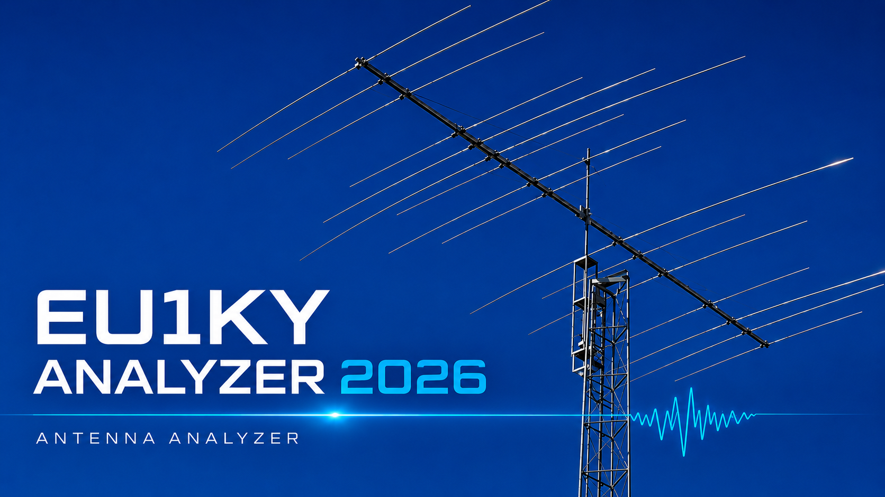
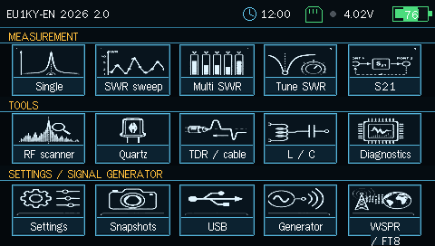
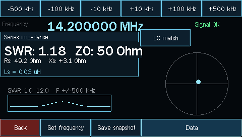
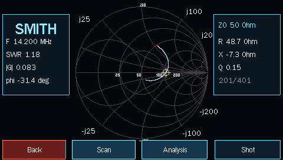
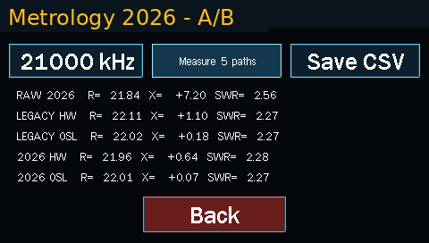

# EU1KY Analyzer 2026

Multilingual firmware and documentation for the **EU1KY Antenna Analyzer** based on STM32F746G-DISCO.

This project is based on the original EU1KY firmware and later development by **DH1AKF, KD8CEC and other contributors**.

It started with the addition of a Polish user interface. During further work and testing, several corrections and interface improvements were introduced as well.

## Current release

**EU1KY-PL 2026 v2.01**

[**Download firmware, manuals and source code →**](https://github.com/SQ2KRR/EU1KY-Analyzer-2026/releases/tag/v2.01)

The release includes ready-to-flash firmware for STM32F746G-DISCO, user manuals and the corresponding source package.
## Screenshots

<table>
  <tr>
    <td align="center">
      <b>Main menu</b> 
      
    </td>
    <td align="center">
      <b>Single measurement</b> 
      
    </td>
  </tr>
  <tr>
    <td align="center">
      <b>Smith chart</b> 
      
    </td>
    <td align="center">
      <b>Metrology 2026 A/B comparison</b> 
      
    </td>
  </tr>
</table>

## Interface languages

The firmware currently includes:

* 🇵🇱 Polish
* 🇬🇧 English
* 🇩🇪 German
* 🇪🇸 Spanish
* 🇷🇺 Russian
* 🇯🇵 Japanese

## User manuals

Full user manuals are currently available in:

- 🇵🇱 **Polski** - [Instrukcja użytkownika](https://github.com/SQ2KRR/EU1KY-Analyzer-2026/releases/download/v2.01/EU1KY-PL_2026_Instrukcja_uzytkownika.pdf)
- 🇬🇧 **English** - [User manual](https://github.com/SQ2KRR/EU1KY-Analyzer-2026/releases/download/v2.01/EU1KY-EN_2026_User_Manual_v1.0.pdf)
- 🇩🇪 **Deutsch** - [Benutzerhandbuch](https://github.com/SQ2KRR/EU1KY-Analyzer-2026/releases/download/v2.01/EU1KY-DE_2026_Benutzerhandbuch_v1.0.pdf)
- 🇪🇸 **Español** - [Manual de usuario](https://github.com/SQ2KRR/EU1KY-Analyzer-2026/releases/download/v2.01/EU1KY-ES_2026_Manual_de_usuario_v1.0.pdf)
- 🇷🇺 **Русский** - [Руководство пользователя](https://github.com/SQ2KRR/EU1KY-Analyzer-2026/releases/download/v2.01/EU1KY-RU_2026_Rukovodstvo_v1.0.pdf)
- 🇯🇵 **日本語** - [ユーザーマニュアル](https://github.com/SQ2KRR/EU1KY-Analyzer-2026/releases/download/v2.01/EU1KY-JP_2026_User_Manual_v1.0.pdf)

The manuals describe firmware v2.0. Version v2.01 contains only minor corrections, so the documentation remains applicable.

## Hardware

EU1KY Analyzer 2026 is intended for analyzers based on:

* STM32F746G-DISCO
* EU1KY RF front end
* Si5351 frequency synthesizer

Support for additional controls and diagnostic functions is also included.

## Download

For normal use, download the latest firmware from **Releases**.

The current release contains:

* ready-to-flash firmware
* Polish user manual
* English user manual
* Russian user manual
* complete source package corresponding to the firmware release

## Project origin

This is a continuation and modification of the work created by the EU1KY amateur radio community.

Major contributors to the earlier project include:

* **Yury Kuchura, EU1KY**
* **Wolfgang Kiefer, DH1AKF**
* **Ian Lee, KD8CEC**
* other contributors to the EU1KY project

EU1KY Analyzer 2026 does not claim authorship of the original analyzer design.

## This development

Additional development, translations and documentation:

**Marek, SQ2KRR**

Feedback from other EU1KY users is very welcome, especially reports from different hardware versions.

## License

This project is distributed under the **GNU General Public License v3.0**.

See the `LICENSE` file for details.   
