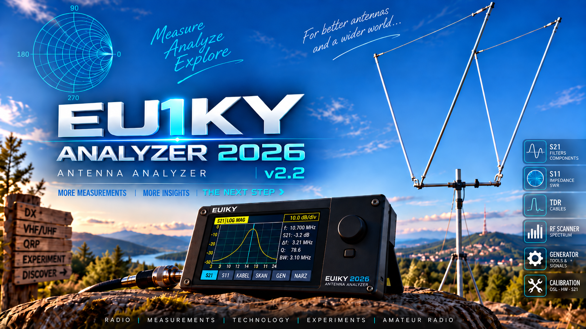

<p align="center">
  
</p>

<h1 align="center">EU1KY Analyzer 2026</h1>

<p align="center">
  <b>Multilingual firmware for the EU1KY Antenna Analyzer</b><br>
  STM32F746G-DISCO · Polish · English · German · Russian
</p>

<p align="center">
  <a href="https://raw.githubusercontent.com/SQ2KRR/EU1KY-Analyzer-2026/main/firmware/EU1KY-PL_2026_V2.2.1.bin">
    <b>⬇ Download firmware V2.2.1</b>
  </a>
</p>

---

## About the project

**EU1KY Analyzer 2026** is a continued development of the original EU1KY antenna analyzer firmware.

The project extends the original firmware with:

- redesigned graphical interface
- expanded measurement functions
- improved calibration workflows
- scalar S21 transmission measurements
- TDR cable analysis
- RF scanner improvements
- additional diagnostics
- extended result analysis
- multilingual user interface
- expanded technical documentation

The project remains based on the original EU1KY analyzer concept while extending its measurement and diagnostic capabilities.

---

# Current firmware

## EU1KY Analyzer 2026 V2.2.1

Current firmware file:

`EU1KY-PL_2026_V2.2.1.bin`

### Direct download

➡️ **[Download EU1KY-PL 2026 V2.2.1 BIN](https://raw.githubusercontent.com/SQ2KRR/EU1KY-Analyzer-2026/main/firmware/EU1KY-PL_2026_V2.2.1.bin)**

The firmware file is also available directly in the repository:

[`firmware/EU1KY-PL_2026_V2.2.1.bin`](firmware/EU1KY-PL_2026_V2.2.1.bin)

Supported interface languages:

- 🇵🇱 Polish
- 🇬🇧 English
- 🇩🇪 German
- 🇷🇺 Russian

---

# What's new in V2.2.1

V2.2.1 is a corrective release based on V2.2.

The main changes concern S21 calibration, TDR operation and LCD display handling.

## S21

- corrected conversion of measured amplitude to dB during calibration diagnostics
- corrected false warnings about excessive calibration deviation
- improved S21 calibration diagnostics
- improved LCD handling during calibration
- reduced unwanted screen flashing during calibration
- clearer information about the required S21 signal path
- improved verification of the calibration attenuator level

A diagnostic error present in the previous implementation was corrected.

The FFT measurement returns an amplitude value. The calibration diagnostic previously used:

`10 × log10(A1 / A2)`

instead of:

`20 × log10(A1 / A2)`

For example, a real **30 dB attenuator** could therefore be interpreted by the diagnostic system as approximately **15 dB**.

This could produce a false warning about excessive deviation even when the attenuator and measurement path were operating correctly.

---

## TDR

- improved velocity-factor handling
- clearer Vf calibration workflow
- improved saving and verification of the velocity factor
- clearer distinction between saving Vf and saving a screenshot
- screenshot function renamed to **Zrzut**
- improved behaviour after changing the cable velocity factor

The displayed cable length depends directly on the configured velocity factor.

A correct TDR time measurement can therefore still produce an incorrect length if the Vf value is wrong.

---

## Display handling

LCD layer handling used during calibration procedures has been improved.

This is intended to eliminate cases where fragments of another screen could briefly appear during calibration.

---

# Important S21 hardware requirement

S21 measurement requires an additional RF output from the **Si5351** synthesizer.

The signal path used by the firmware is:

```text
S2 / CLK2  →  DUT  →  S1
```

where:

- **S2 / CLK2** — tracking-generator output
- **DUT** — device under test
- **S1** — analyzer receiver input

Many standard EU1KY analyzer builds do **not** have CLK2 brought out to an external connector.

To use S21, CLK2 must therefore be physically connected to an additional RF connector installed in the analyzer enclosure.

The connector may be, for example:

- BNC
- SMA
- UHF / SO-239

The RF connection should be short, mechanically reliable and suitable for the frequency range being measured.

The firmware can verify that the Si5351 synthesizer is configured, but it cannot determine whether the CLK2 output has actually been connected to an external socket.

---

# Quick S21 guide

Before performing S21 measurements, the analyzer must be calibrated.

## 1. THRU calibration

Connect the S21 generator output directly to the receiver input:

```text
S2 / CLK2  →  S1
```

Use the shortest practical 50 Ω connection.

## 2. Attenuator calibration

Insert a known 50 Ω attenuator between the two ports:

```text
S2 / CLK2  →  attenuator  →  S1
```

A good starting value is:

- 30 dB
- or 40 dB

Enter the actual attenuation value in the analyzer.

A 30 dB attenuator generally provides a larger margin above the receiver noise floor.

A 40 dB attenuator provides a wider calibration span but requires a sufficiently stable receiver signal.

## 3. Measurement

After calibration connect the device under test:

```text
S2 / CLK2  →  DUT  →  S1
```

The DUT may be, for example:

- LC filter
- ceramic filter
- quartz filter
- attenuator
- simple RF network

Select the frequency range and start the measurement.

The analyzer displays the scalar transmission characteristic as a function of frequency.

---

# Quick TDR guide

TDR is used to locate impedance discontinuities and estimate cable length.

Connect the cable to the normal measurement port and select:

**Analysis → TDR**

Run a scan.

The analyzer measures the delay of the reflected signal.

The displayed distance depends on the configured cable velocity factor:

```text
Vf = propagation velocity in cable / speed of light
```

Typical coaxial cables may have Vf values approximately between:

```text
0.60 ... 0.90
```

depending on construction and dielectric material.

## Calibrating Vf using a cable of known length

If the physical cable length is known:

1. connect the cable
2. leave the far end OPEN or SHORT
3. perform a TDR scan
4. place the cursor on the reflection from the cable end
5. select **Set Vf**
6. enter the real cable length
7. allow the analyzer to calculate the new Vf
8. select **Save Vf**
9. repeat the scan

Example:

```text
Displayed length: 17.45 m
Current Vf:       0.66
Actual length:    21.00 m
```

The resulting velocity factor is approximately:

```text
Vf ≈ 0.794
```

After saving the corrected Vf and repeating the scan, the indicated cable length should approach the actual value.

---

# Main features

EU1KY Analyzer 2026 includes, among others:

- single-frequency impedance measurement
- SWR measurement
- resistance and reactance measurement
- SWR graphs
- impedance graphs
- multi-band measurements
- antenna tuning tools
- Smith chart
- scalar S21 transmission measurement
- extended S21 result analysis
- TDR cable analysis
- RF scanner
- RF component measurements
- L measurement
- C measurement
- R measurement
- quartz crystal analysis
- frequency search
- RF signal generator
- WSPR signal generation
- FT8 signal generation
- antenna design tools
- OSL calibration
- hardware calibration
- S21 calibration
- calibration verification
- calibration status
- battery monitoring
- battery calibration
- SD card functions
- USB functions
- hardware diagnostics
- multilingual graphical interface

---

# S21 analysis

The S21 implementation provides considerably more information than a simple transmission trace.

Depending on the measured device and available signal-to-noise ratio, the firmware can determine:

- maximum transmission level
- minimum transmission level
- trace dynamic range
- -3 dB bandwidth
- -6 dB bandwidth
- -10 dB bandwidth
- -20 dB bandwidth
- -40 dB bandwidth
- -60 dB bandwidth
- center frequency
- Q factor
- selectivity
- shape factor
- passband ripple
- asymmetry
- slope
- local maxima P1 and P2
- dip between local resonances
- measurement quality
- receiver noise information

The firmware also includes an **Auto** mode intended to assist with observing and locating interesting parts of a measured response.

For final measurements, the normal full measurement mode is recommended.

---

# RF scanner

The RF scanner allows the analyzer to operate as a simple diagnostic RF receiver.

It can be used to observe:

- RF activity
- relative signal level
- spectrum structure
- narrowband signals
- local interference
- signal changes over time

The scanner frequency calibration was verified on real hardware.

Testing showed a repeatable frequency error corresponding to the Si5351 reference oscillator.

Instead of applying different corrections to individual bands, the synthesizer reference correction was adjusted at the source.

This follows the normal metrological principle of correcting the source of systematic error rather than masking the result afterwards.

---

# User interface

The V2.2 generation uses the redesigned EU1KY Analyzer 2026 graphical interface.

The current firmware build uses the **RETRO** graphical style.

At present, multiple complete graphical themes are not included simultaneously because the STM32F746 flash memory is already heavily utilized by the expanded firmware.

Alternative interface styles may therefore be provided later as separate firmware builds using the same measurement code.

This avoids wasting flash memory on several complete graphic resource sets that cannot be used simultaneously.

---

# Documentation

Technical documentation is being developed progressively.

The main documentation currently focuses on the **Measurement** and **Analysis** sections.

## V2.2 — S21 scalar transmission

The Polish-language S21 documentation covers:

- four-terminal network theory
- S-parameters
- scalar S21 measurement
- meaning of S11, S21, S12 and S22
- EU1KY S21 signal path
- S21 calibration
- THRU calibration
- calibration attenuator
- construction of a 40 dB / 50 Ω calibration attenuator
- measurement range
- frequency step
- sampling density
- manual measurement
- Auto mode
- result pages
- maximum and minimum transmission
- dynamic range
- -3 dB bandwidth
- -6 / -10 / -20 / -40 / -60 dB bandwidths
- center frequency
- Q factor
- selectivity
- shape factor
- passband ripple
- asymmetry
- local maxima
- resonance dips
- receiver noise floor
- measurement quality
- LC filter measurements
- ceramic filter measurements
- quartz filter measurements
- source and load impedance
- practical interpretation of real measurements

---

## V2.2 — Analysis documentation

The current Polish documentation for the Analysis section includes material concerning:

- S21
- RF scanner
- TDR / cable analysis
- quartz crystal analysis

Currently published documentation:

➡️ [Download Chapters 6–7 — Analysis](docs/EU1KY-PL_2026_V2.2_ANALIZA_Rozdzialy_6-7.pdf)

---

## Earlier V2.1 documentation

The V2.1 Measurement manual remains available because much of the basic measurement workflow is still relevant.

### Polish

➡️ [Part 1 — Measurement](docs/EU1KY-PL_2026_V2.1_Manual_Part_1_Measurement.pdf)

### Russian

➡️ [Part 1 — Measurement](docs/EU1KY-RU_2026_V2.1_Manual_Part_1_Measurement.pdf)

All currently published manuals are available in:

[`docs/`](docs/)

---

# Documentation status

Documentation is still being expanded.

Further material is planned or being prepared for:

- calibration and calibration management
- generator functions
- digital signal functions
- antenna design tools
- files and SD card functions
- settings
- diagnostics
- metrology and verification
- service functions
- hardware modifications
- additional language versions

---

# Source code

The source code required to build the firmware is included in this repository.

Main directories:

```text
Src/       firmware source code
tools/     build and verification tools
firmware/  compiled firmware files
images/    project graphics and screenshots
docs/      user documentation
```

Build configuration files are located in the repository root.

---

# Firmware files

Current firmware:

```text
firmware/EU1KY-PL_2026_V2.2.1.bin
```

Previous firmware:

```text
firmware/EU1KY-PL_2026_V2.2.bin
```

Direct download of the current firmware:

➡️ **[EU1KY-PL_2026_V2.2.1.bin](https://raw.githubusercontent.com/SQ2KRR/EU1KY-Analyzer-2026/main/firmware/EU1KY-PL_2026_V2.2.1.bin)**

---

# Previous releases

Earlier firmware versions remain available for historical reference and for users who prefer older configurations.

## V2.2

V2.2 introduced a substantially expanded Analysis section, including:

- extended S21 measurements
- extended S21 result pages
- RF scanner improvements
- expanded filter analysis
- additional diagnostics

V2.2.1 supersedes V2.2 for normal use.

## V2.1

V2.1 introduced the redesigned 2026 graphical interface and formed the basis for the current V2.2 generation.

Previous V2.1 firmware and documentation remain available through the repository history and GitHub Releases.

## V2.01

V2.01 is preserved as an earlier complete release.

It used an earlier graphical interface and supported additional development branches.

➡️ [Download EU1KY Analyzer 2026 V2.01](https://github.com/SQ2KRR/EU1KY-Analyzer-2026/releases/tag/v2.01)

---

# GitHub Releases

Published releases are available here:

➡️ [EU1KY Analyzer 2026 — Releases](https://github.com/SQ2KRR/EU1KY-Analyzer-2026/releases)

The most recent development firmware may appear in the `firmware/` directory before a corresponding GitHub Release is created.

For this reason, the direct firmware link at the top of this README should be used when testing the newest V2.2.1 build.

---

# Hardware

EU1KY Analyzer 2026 is intended primarily for analyzers based on:

- STM32F746G-DISCO
- EU1KY RF front end
- Si5351 frequency synthesizer

Actual usable frequency range and measurement performance depend on:

- individual analyzer hardware
- RF front-end version
- Si5351 module
- wiring
- connectors
- calibration quality
- measurement cables
- adapters
- environmental conditions

Different EU1KY hardware revisions may therefore have different practical measurement limits.

---

# Calibration notice

Calibration data is specific to the individual analyzer and its RF measurement path.

After installing new firmware, verify calibration status before performing precision measurements.

Changing:

- adapters
- measurement cables
- connectors
- calibration plane
- RF path components

may require a new calibration.

OSL calibration should be performed using suitable OPEN, SHORT and LOAD standards.

S21 calibration requires both THRU and a known attenuator.

---

# Measurement limitations

EU1KY Analyzer 2026 is an amateur measurement instrument and should not be interpreted as a replacement for a calibrated laboratory VNA.

In particular:

- S21 is currently a scalar transmission measurement
- S21 phase is not measured
- very deep filter attenuation may approach the receiver noise floor
- Si5351 output contains harmonics
- source and load impedance influence filter measurements
- cable Vf directly affects TDR distance
- measurement accuracy depends strongly on calibration quality

Always interpret calculated parameters together with the raw measurement trace.

---

# SWR notice

A low SWR value does not by itself indicate antenna efficiency.

A 50 Ω resistive load can have an excellent SWR while radiating virtually no RF energy.

SWR describes impedance matching, not antenna radiation efficiency.

---

# Safety

Always observe normal RF and electrical safety precautions.

Before connecting the analyzer:

- disconnect transmitters from the measured antenna
- ensure that no significant RF power is present at the analyzer input
- avoid measurements on energized circuits
- discharge large capacitors before connection
- observe battery safety
- inspect cables and connectors for damage

The analyzer input is intended for measurement signals, not transmitter power.

---

# Project origin

This project is a continuation and modification of work created by the EU1KY amateur radio community.

Major contributors to earlier EU1KY development include:

- **Yury Kuchura, EU1KY**
- **Wolfgang Kiefer, DH1AKF**
- **Ian Lee, KD8CEC**
- other contributors to the EU1KY project

EU1KY Analyzer 2026 does not claim authorship of the original EU1KY analyzer hardware or original firmware concept.

---

# EU1KY Analyzer 2026 development

Additional development, graphical interface work, firmware modifications, measurement testing, translations and documentation:

**Marek, SQ2KRR**

Testing reports, bug reports and suggestions are welcome, especially from users with different EU1KY hardware versions.

Real-world testing is particularly useful for:

- S21 calibration
- filter measurements
- TDR
- RF scanner
- frequency accuracy
- calibration behaviour
- LCD behaviour
- different Si5351 modules
- different EU1KY RF front-end versions

---

# Contributions

Contributions may include:

- technical review
- source-code corrections
- bug reports
- measurement verification
- screenshots
- test results from different hardware versions
- documentation
- translations
- source-code improvements

Please use the **Issues** section of this repository for reports and suggestions:

➡️ [GitHub Issues](https://github.com/SQ2KRR/EU1KY-Analyzer-2026/issues)

---

# License

This project is distributed under the **GNU General Public License v3.0**.

See the [`LICENSE`](LICENSE) file for details.
