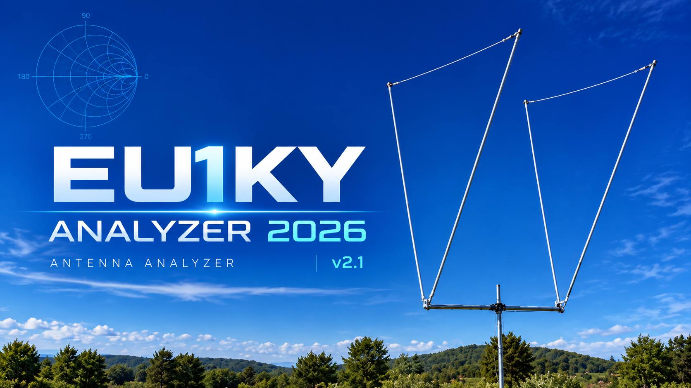
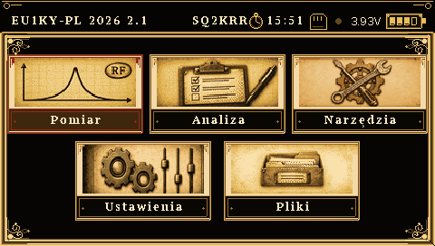
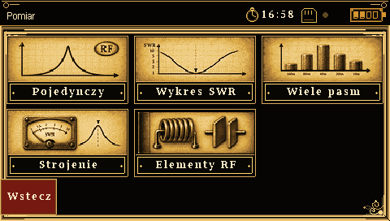
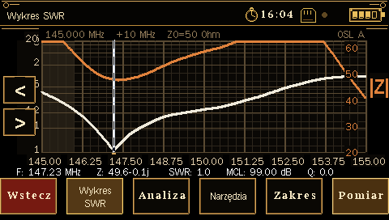
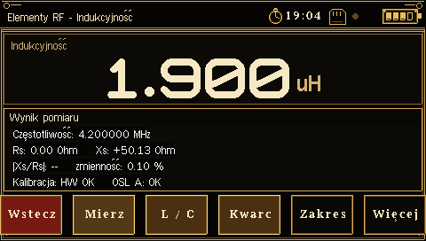

# EU1KY Analyzer 2026

  

  <b>Multilingual firmware for the EU1KY Antenna Analyzer</b> 
  STM32F746G-DISCO · Polish · English · German · Russian

EU1KY Analyzer 2026 is a continued development of the original EU1KY antenna analyzer firmware.

Version 2.1 introduces a redesigned graphical interface, improved measurement presentation, calibration workflow improvements, additional diagnostic and utility functions, and a unified multilingual user interface.

---

## Current stable release

### EU1KY Analyzer 2026 v2.1

Supported interface languages:

- 🇵🇱 Polish
- 🇬🇧 English
- 🇩🇪 German
- 🇷🇺 Russian

### ➡️ [Download the latest release](https://github.com/SQ2KRR/EU1KY-Analyzer-2026/releases/latest)

The release contains:

- ready-to-flash `.bin` firmware
- Intel HEX `.hex` firmware image
- complete source package
- source code available directly in this repository

---

## Main features

EU1KY Analyzer 2026 includes, among others:

- single-frequency impedance measurement
- SWR, resistance and reactance measurements
- SWR and impedance graphs
- multi-band measurements
- antenna tuning tools
- Smith chart
- S21 measurements
- TDR cable measurements
- RF component measurements
- L, C and R measurements
- quartz crystal measurement tools
- frequency search
- RF signal generator
- WSPR / FT8 signal generation
- antenna design tools
- OSL calibration
- hardware calibration
- S21 calibration
- calibration verification and status
- battery monitoring and calibration
- SD card file functions
- USB functions
- hardware diagnostics
- multilingual graphical interface

Version 2.1 also introduces a substantially redesigned visual interface with new icons, improved screen layout and a more consistent presentation throughout the firmware.

---

## Screenshots

The screenshots below show the Polish interface of version 2.1.  
The same menu structure and functions are available in English, German and Russian.

<table>
<tr>
<td align="center">
<b>Main menu</b> 

</td>

<td align="center">
<b>Measurement menu</b> 

</td>
</tr>

<tr>
<td align="center">
<b>SWR graph</b> 

</td>

<td align="center">
<b>RF component measurement</b> 

</td>
</tr>
</table>

---

## Firmware download

For normal use, download the current firmware from:

### ➡️ [EU1KY Analyzer 2026 — Latest Release](https://github.com/SQ2KRR/EU1KY-Analyzer-2026/releases/latest)

Version 2.1 provides:

- `EU1KY_Analyzer_2026_v2.1.bin`
- `EU1KY_Analyzer_2026_v2.1.hex`
- `EU1KY_Analyzer_2026_v2.1_sources.zip`

For users who only want to install the firmware, the `.bin` file is normally the simplest choice.

Previous firmware releases remain available in the **Releases** section.

---
---

## Previous release — EU1KY Analyzer 2026 v2.01

Version **v2.01** is preserved as the previous complete release of EU1KY Analyzer 2026.

It uses the earlier graphical interface and is still available for users who prefer that version or require the additional translations and manuals prepared for it.

### EU1KY Analyzer 2026 v2.01

**Interface languages:**

- 🇵🇱 Polish
- 🇬🇧 English
- 🇩🇪 German
- 🇪🇸 Spanish
- 🇷🇺 Russian
- 🇯🇵 Japanese

**User manuals available for this release:**

- Polish
- English
- German
- Spanish
- Russian
- Japanese

### ➡️ [Download EU1KY Analyzer 2026 v2.01](https://github.com/SQ2KRR/EU1KY-Analyzer-2026/releases/tag/v2.01)

The v2.01 release includes firmware, source code and multilingual documentation.

### v2.01 visual identity

  

### Screenshots from v2.01

<table>
<tr>
<td align="center">
<b>Main menu</b> 

</td>

<td align="center">
<b>Single measurement</b> 

</td>
</tr>

<tr>
<td align="center">
<b>Smith chart</b> 

</td>

<td align="center">
<b>Metrology 2026 A/B comparison</b> 

</td>
</tr>
</table>

> **Note:** v2.01 is an older release and differs from v2.1 in interface design, available functions and language support. It is preserved for historical reference and for users who prefer the previous version.

---

## Source code

The source code required to build the firmware is included directly in this repository.

Main directories:

- `Src/` – firmware source code
- `tools/` – build and verification tools
- `firmware/` – compiled firmware files
- `images/` – project graphics and screenshots

Build configuration files are located in the repository root.

A separate source archive corresponding to the public firmware release is also available in the release assets.

---

## Documentation

A new detailed user manual for **EU1KY Analyzer 2026 v2.1** is currently being prepared.

The new documentation will describe the individual functions step by step using actual screenshots captured from the analyzer.

It will cover, among others:

- first configuration
- calibration
- single-frequency measurements
- SWR measurements
- Smith chart
- TDR
- S21
- RF component measurements
- generator functions
- antenna tools
- diagnostics
- configuration and service functions

Documentation prepared for older firmware versions may differ from version 2.1 in menu structure, graphics and available functions.

---

## Hardware

EU1KY Analyzer 2026 is intended primarily for analyzers based on:

- STM32F746G-DISCO
- EU1KY RF front end
- Si5351 frequency synthesizer

Actual usable frequency range and measurement performance depend on the individual hardware configuration, RF front end and calibration quality.

---

## Calibration notice

Calibration data is specific to the individual analyzer and its RF measurement path.

After installing new firmware, verify the calibration status before performing precision measurements.

Changing adapters, measurement cables or other elements between the calibration plane and the measured device may require a new calibration.

A low SWR value does not by itself indicate antenna efficiency.

A 50 Ω resistive load can have an excellent SWR while radiating virtually no RF energy.

Always observe RF and electrical safety precautions when working with antennas and connected transmitters.

---

## Project origin

This project is a continuation and modification of work created by the EU1KY amateur radio community.

Major contributors to earlier EU1KY development include:

- **Yury Kuchura, EU1KY**
- **Wolfgang Kiefer, DH1AKF**
- **Ian Lee, KD8CEC**
- other contributors to the EU1KY project

EU1KY Analyzer 2026 does not claim authorship of the original EU1KY analyzer design.

---

## EU1KY Analyzer 2026 development

Additional development, interface redesign, testing, translations and documentation:

**Marek, SQ2KRR**

Testing reports, bug reports and suggestions are welcome, especially from users with different EU1KY hardware configurations.

---

## License

This project is distributed under the **GNU General Public License v3.0**.

See the [`LICENSE`](LICENSE) file for details.
